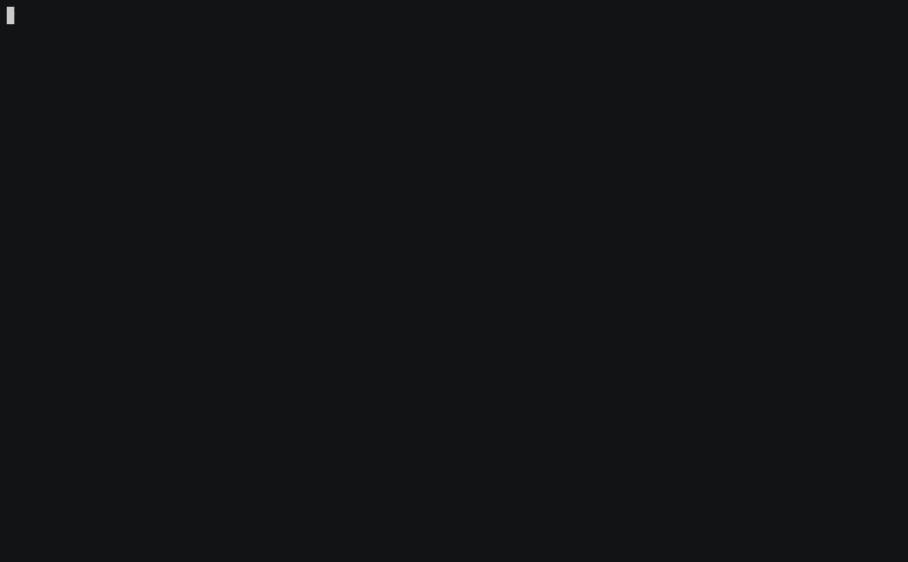

# noelTexturesPy
Dash app to generate textures maps from MRI using Advanced Normalization Tools ([ANTsPy](https://antspy.readthedocs.io/en/latest/))
<hr>

## Prerequisites
- [Docker](https://www.docker.com/get-started)

OS specific installation instructions: https://github.com/NOEL-MNI/noelTexturesPy/wiki/Installation




## Run the app (using prebuilt images)
```bash
docker pull noelmni/pynoel-gui-app:latest
docker run --rm -p 9999:9999 noelmni/pynoel-gui-app:latest
```
Access the Web UI at http://localhost:9999

## Build the app
#### M1 Apple Silicon supported, M2 untested as of 10-11-2022
```bash
git clone https://github.com/NOEL-MNI/noelTexturesPy.git
cd noelTexturesPy
PLATFORMS=linux/arm64,linux/amd64
TAG=latest
docker buildx build --push --platform ${PLATFORMS} -t noelmni/pynoel-gui-base:${TAG} base-docker-image/
docker buildx build --push --platform ${PLATFORMS} -t noelmni/pynoel-gui-app:${TAG} . --build-arg BASE_SHORT_SHA_TAG=${TAG}
```
### Troubleshoot `buildx` errors
```bash
docker run --rm --privileged multiarch/qemu-user-static --reset -p yes
docker buildx create --name multiarch --driver docker-container --use
docker buildx inspect --bootstrap
```

## Required inputs
Please ensure the file(s) are renamed accordingly before uploading it to `noelTexturesPy`.
```
- T1-weighted image must include the string “t1” or “T1” in its filename, and/or
- T2-weighted (or FLAIR) image must include either “t2”, “T2”, “flair”, or “FLAIR”
```

<hr>


