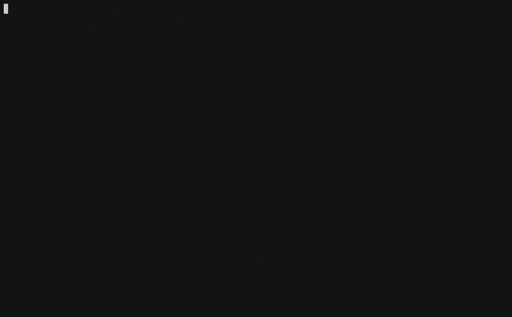

# noelTexturesPy
Dash app to generate textures maps from MRI using Advanced Normalization Tools ([ANTsPy](https://antspyx.readthedocs.io/en/latest/))
<hr>

**Documentation**: https://noel-mni.github.io/noelTexturesPy/

<hr>

## Prerequisites
- [Pixi](https://pixi.sh) (for pixi-based installation, preferred method for local installation)
- [Docker](https://www.docker.com/get-started) (for Docker installation)
- [Micromamba](https://mamba.readthedocs.io/en/latest/installation/micromamba-installation.html) (for legacy conda-based installations)

### Installing Pixi
```bash
# Linux/macOS (recommended method)
curl -fsSL https://pixi.sh/install.sh | sh

# Alternative methods:
# Homebrew (macOS): brew install pixi
# Conda-forge: conda install -c conda-forge pixi

# Add pixi to your PATH (if not automatically added)
export PATH="$HOME/.pixi/bin:$PATH"
echo 'export PATH="$HOME/.pixi/bin:$PATH"' >> ~/.bashrc
```

### Installing Micromamba
```bash
# Linux/macOS
mkdir -p ~/bin
# Download micromamba binary on Linux
curl -Ls https://micro.mamba.pm/api/micromamba/linux-64/latest | tar -xvj ~/bin/micromamba
# Download micromamba binary on macOS
# For Intel Macs (osx-64)
curl -Ls https://micro.mamba.pm/api/micromamba/osx-64/latest | tar -xvj ~/bin/micromamba
# For Apple Silicon Macs (osx-arm64)
curl -Ls https://micro.mamba.pm/api/micromamba/osx-arm64/latest | tar -xvj ~/bin/micromamba

# Add micromamba to your PATH
export PATH=~/bin:$PATH
echo 'export PATH=~/bin:$PATH' >> ~/.bashrc
# Initialize micromamba shell
mkdir -p ~/micromamba
export MAMBA_ROOT_PREFIX=~/micromamba
echo 'export MAMBA_ROOT_PREFIX=~/micromamba' >> ~/.bashrc
eval "$(micromamba shell hook -s posix)"

# Or using package managers:
# Homebrew (macOS): brew install micromamba
# Conda-forge: conda install -c conda-forge micromamba
```

OS specific installation instructions: https://github.com/NOEL-MNI/noelTexturesPy/wiki/Installation


## Local Installation with Pixi
For local development using pixi (modern conda-compatible package manager):

```bash
# Clone the repository
git clone https://github.com/NOEL-MNI/noelTexturesPy.git
cd noelTexturesPy

# Install dependencies and create environment using pixi
pixi install

# Run the application
pixi run textures_app

# Or with custom port
pixi run textures_app --port 9988

# Or in debug mode
pixi run textures_app --debug --port 9988
```

Access the Web UI at http://localhost:9999 (or your specified port)

## CLI (Headless)

`textures_cli` runs the same pipeline without a browser — suitable for batch processing, HPC clusters, and scripted workflows.

```bash
# T1 only
textures_cli --t1 sub-001/t1.nii.gz

# T1 + FLAIR, explicit case ID and output directory
textures_cli --t1 sub-001/t1.nii.gz --t2 sub-001/flair.nii.gz \
             --case-id sub001 --output-dir ./results/sub-001

# Full help
textures_cli --help
```

See the [full CLI reference](docs/cli.md) for all options.

## Run the app (using prebuilt images)
```bash
docker pull noelmni/textures-py:latest
docker run --rm -p 9999:9999 noelmni/textures-py:latest
```
Access the Web UI at http://localhost:9999



## Local Installation with Micromamba
For local development and usage, you can install the app using micromamba:

```bash
# Clone the repository
git clone https://github.com/NOEL-MNI/noelTexturesPy.git
cd noelTexturesPy

# Create conda environment from lock file
micromamba create --name pytextures --file conda-lock.yml --yes
# conda create --name pytextures --file conda-lock.yml --yes

# Activate the environment
micromamba activate pytextures
# conda activate pytextures

# Install the package in editable mode
pip install -editable .

# Run the application
textures_app --port 9999
```

Access the Web UI at http://localhost:9999

## Build the app
#### M1 Apple Silicon supported/tested, M2, M3, M4 untested as of 01-July-2025 (but will likely work without issues)
```bash
git clone https://github.com/NOEL-MNI/noelTexturesPy.git
cd noelTexturesPy
PLATFORMS=linux/arm64,linux/amd64
TAG=latest
docker buildx build --push --platform ${PLATFORMS} -t noelmni/pynoel-gui-base:${TAG} base-docker-image/
docker buildx build --push --platform ${PLATFORMS} -t noelmni/textures-py:${TAG} . --build-arg BASE_SHORT_SHA_TAG=${TAG}
```
### Troubleshoot `buildx` errors
```bash
docker run --rm --privileged multiarch/qemu-user-static --reset -p yes
docker buildx create --name multiarch --driver docker-container --use
docker buildx inspect --bootstrap
```

## Required inputs
Please ensure the file(s) are renamed accordingly before uploading it to `noelTexturesPy`.
```
- T1-weighted image must include the string “t1” or “T1” in its filename, and/or
- T2-weighted (or FLAIR) image must include either “t2”, “T2”, “flair”, or “FLAIR”
```

<hr>


