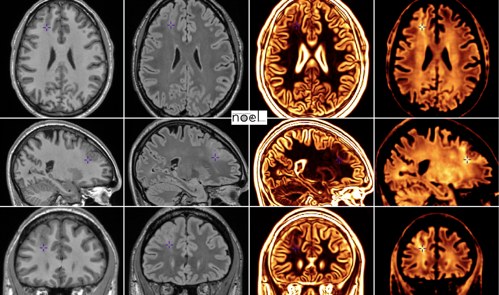
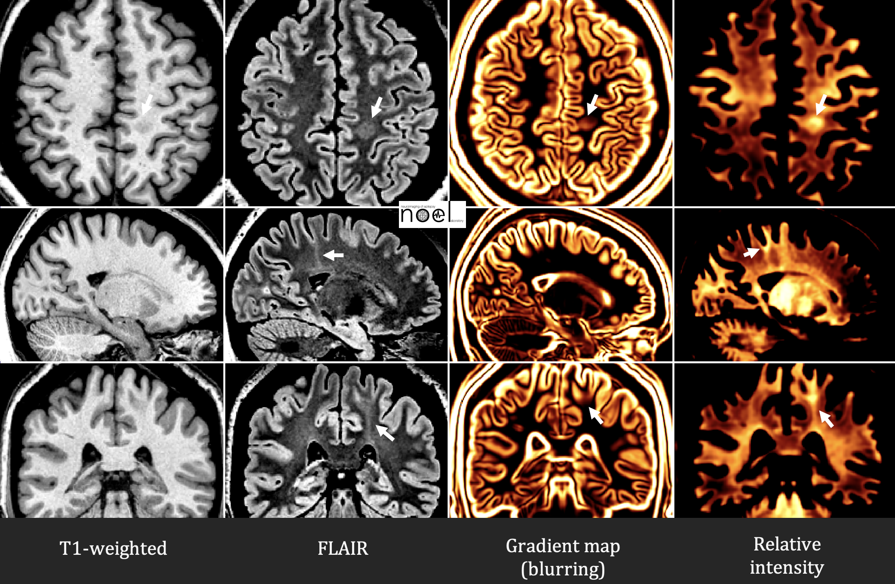
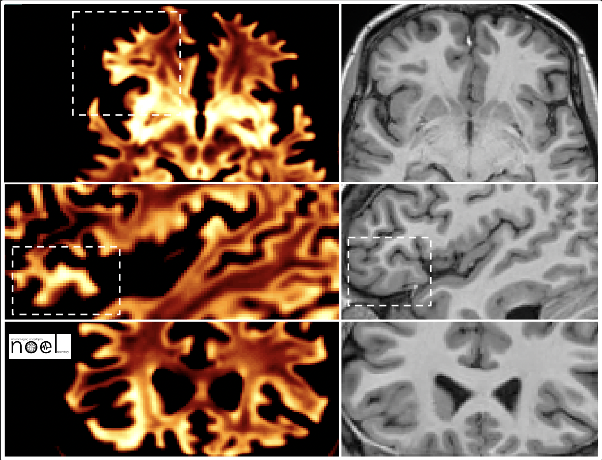
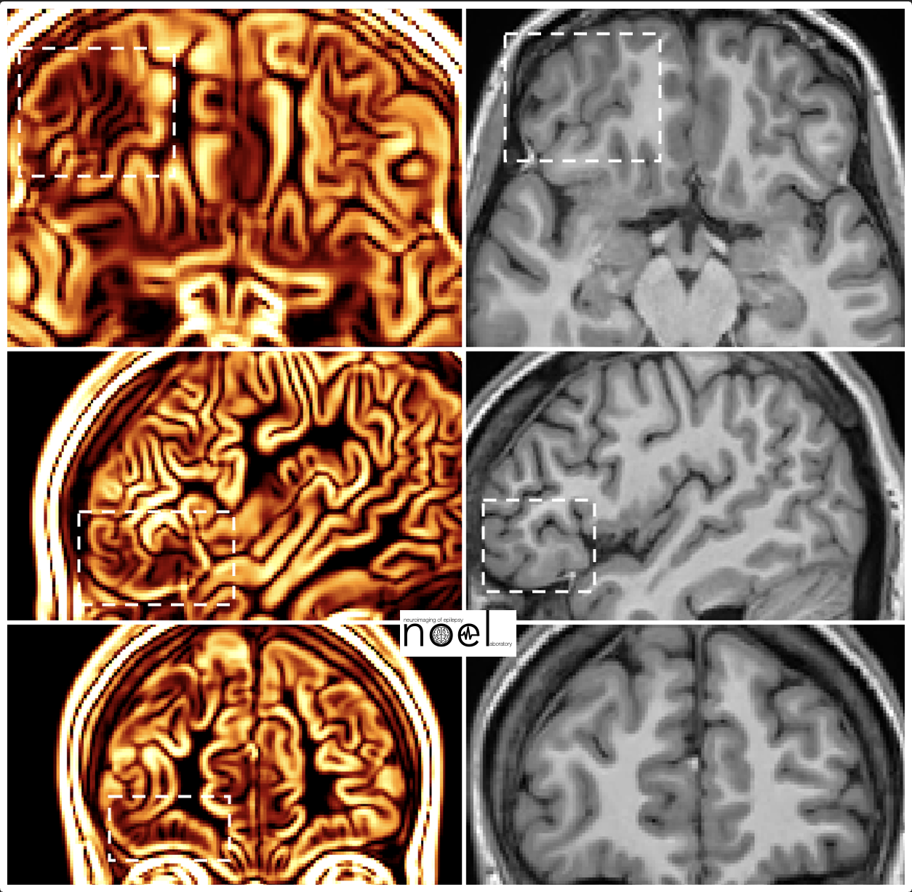
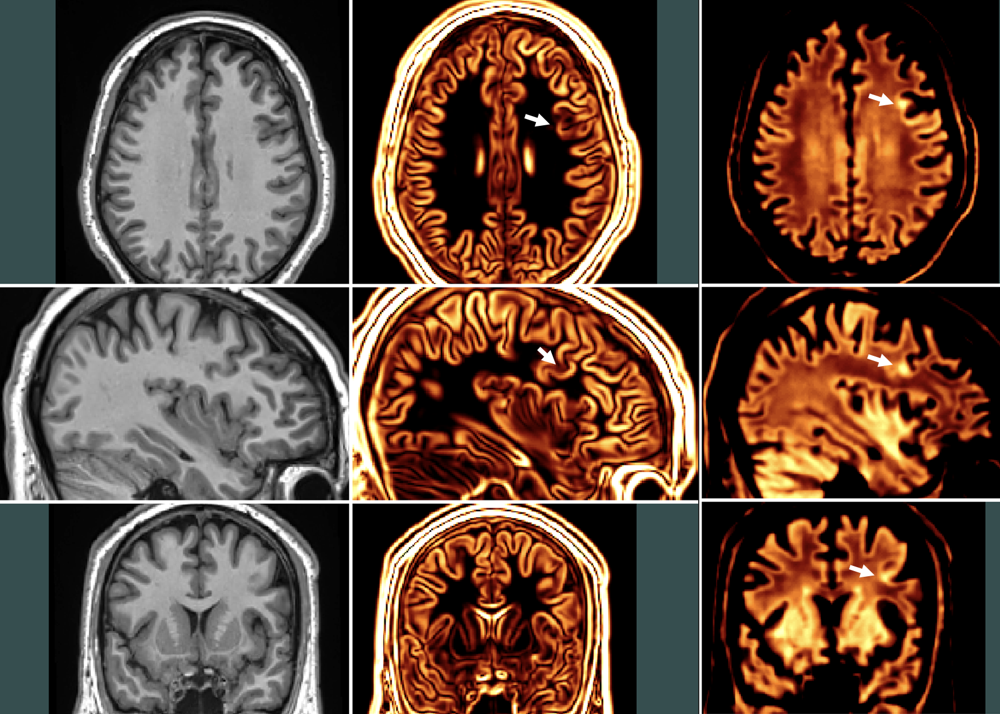
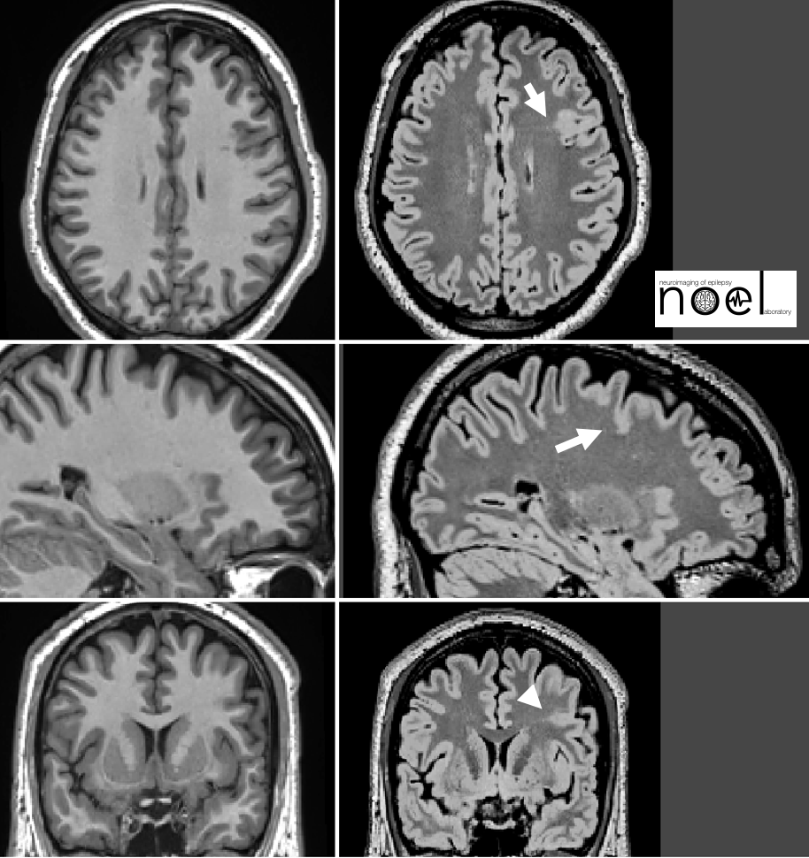
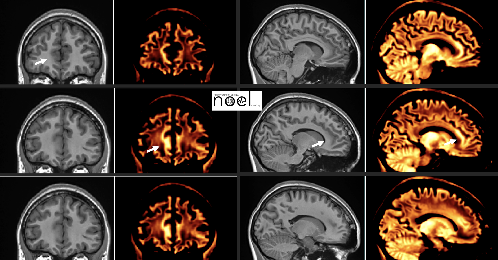

The following pages show several examples of FCD lesions of various size and locations (indicated by the cross or white arrows). All lesions shown here were confirmed histologically after surgical resection to treat drug-resistant seizures.

### Case 1

### Case 2

### Case 3

This case demonstrates that large lesions may also be difficult to see, not only small lesions

### Case 4

Small FCD, not visible on T1; on the other hand, FLAIR images show the subtle transmantle sign. The texture maps show both FCD-related blurring and hyperintensity.

### Case 5

