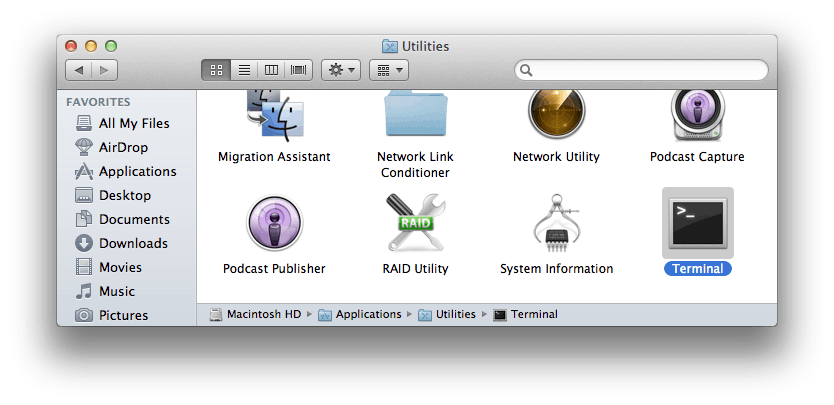
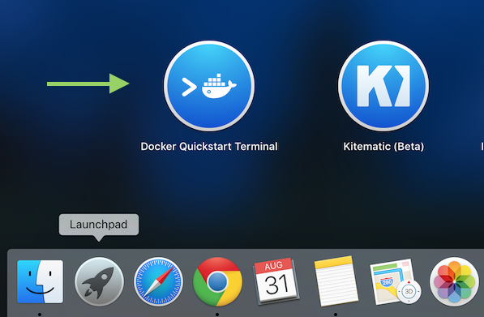
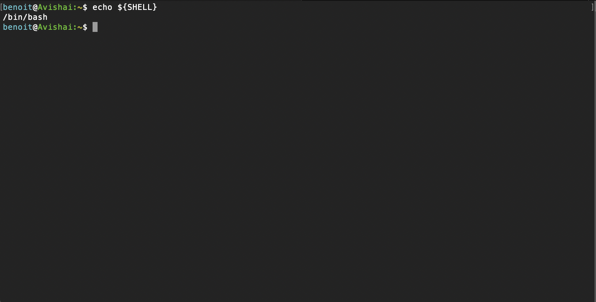
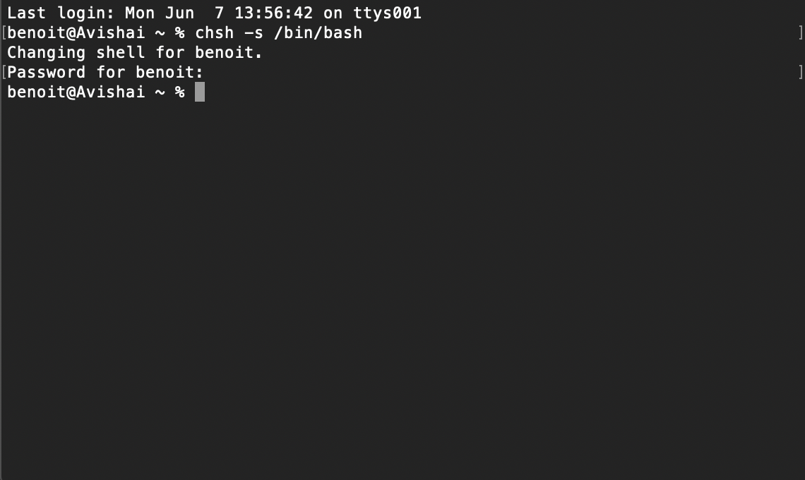
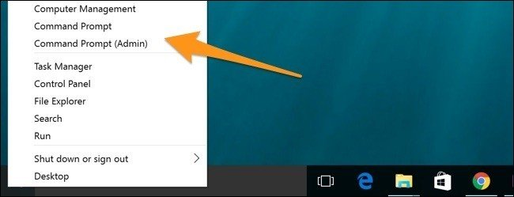
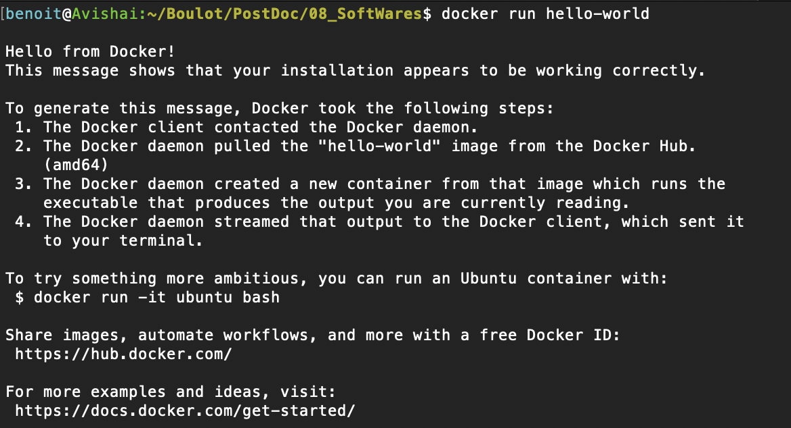

### MacOS

To know which version of MacOS you are running, please click on the "Apple" menu icon (top left of the screen) and go to "About This Mac". You'll see the MacOS version name (e.g., Mojave), followed by its version number (official instructions by Apple can be found at the following address: <https://support.apple.com/en-us/HT201260>).

#### MacOS 10.14 or higher

You can download *Docker* from: https://desktop.docker.com/mac/stable/amd64/Docker.dmg.

Installation is like for any other MacOS Application: double-click on Docker.dmg, drag and drop Docker.app into the Application folder and then double-click on Docker.app in the Applications folder to start the program ([https://docs.docker.com/docker-for-mac/install/](https://docs.docker.com/docker-for-mac/install/)).

#### MacOS 10.8 to 10.13

Download the installer:

https://github.com/docker/toolbox/releases/download/v19.03.1/DockerToolbox-19.03.1.pkg

**WARNING: Docker Toolbox is discontinued. No further support is
provided.**

### Windows

To know which version of Windows your computer is running, type the
following:
[https://support.microsoft.com/en-ca/help/13443/windows-which-version-am-i-running](https://support.microsoft.com/en-ca/help/13443/windows-which-version-am-i-running)

#### Windows 10

Download the installer:
<https://download.docker.com/win/stable/Docker%20Desktop%20Installer.exe>

Installation is done following the installation wizard, as any other
windows program.

Windows 10 Home user should also follow the instructions contained in
the following link:

<https://docs.docker.com/docker-for-windows/install/>

#### Windows 8.1 and 7

Download the installer:
<https://github.com/docker/toolbox/releases/download/v19.03.1/DockerToolbox-19.03.1.exe>

Installation is done by following the installation wizard, as for any
Windows program.

!!! WARNING
    Docker Toolbox is deprecated. No further support is provided

## Launch a terminal window

If you are running MacOS 10.12 or Windows 10 Pro, Enterprise or
Education, you can open a terminal.

### MacOS 10.14 or higher

You will find the terminal application in "Application/Utilities".

### MacOS 10.8 to 10.13

Open the launch pad and look for the Docker Quickstart Terminal.

When started, the terminal will run several programs in background and
display its activities. Let it run as it sets a clean terminal
environment for you.

#### Check the default shell on MacOS

Something important to consider is the default **shell** used in the
terminal. A shell is a user interface to the various operating system
services. The terminal is the program that opens a graphical window
providing access to the shell in the form of a *command-line interface*
(CLI). The most common shells are: sh (Bourne Shell), bash (Bourne Again
shell), zsh (Z-shell), csh (C-shell), ksh (Korn-shell), etc.

!!! info "Important"
    The rest of this document assumes that the default shell
    used for MacOS is `bash`

To check which shell is the current default, open the 'Terminal'
application and type the following command: `echo ${SHELL}`

If the result of the command is: `/bin/bash`, you are good to go.

If something else appears, you must change the default bash by typing: `chsh -s /bin/bash`

As a change in setting the default bash is an administration task, you will be asked to enter your MacOS administrator password in the terminal. In order to effectively modify the bash, after you enter the password, you still need to close the terminal, reopen it and verify that the default shell is bash.

### Windows 10

Make sure *Docker* is run with administrator privileges. To do so, right-click in task bar, use "run as administrator". Press Windows Button + X to open power user menu and click on "Command Prompt".

### Windows 7 and 8.1

On your desktop, locate the Docker Quickstart Terminal icon and double
click on it.

## Verify that Docker is running

Type: `docker version` and/or `docker info` or `docker run hello-world` as
shown below:

Congratulations - You went through the hardest part!