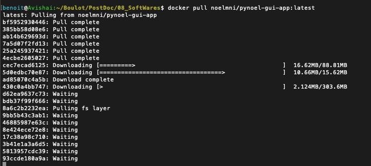
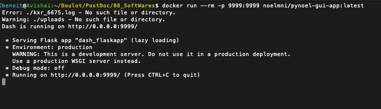
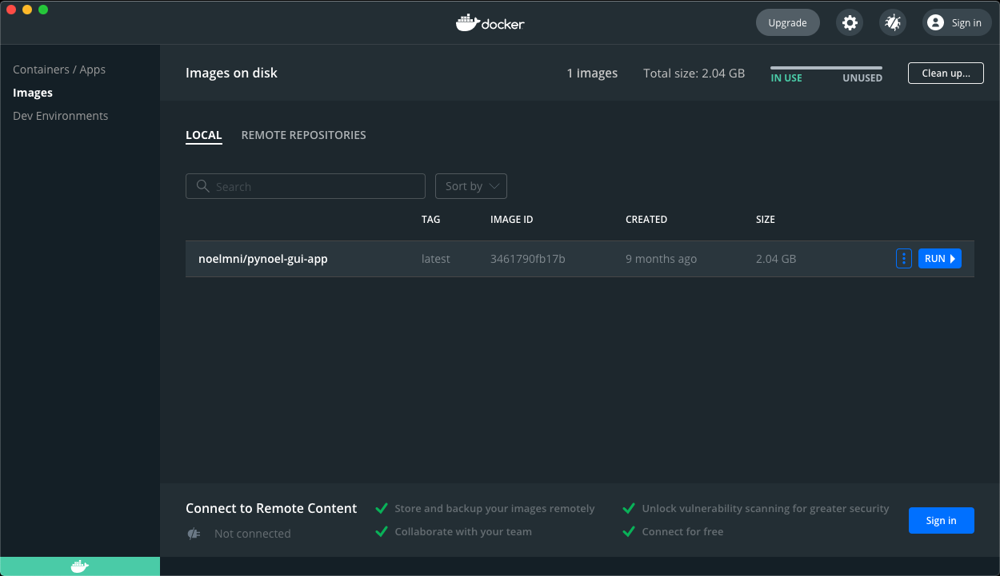
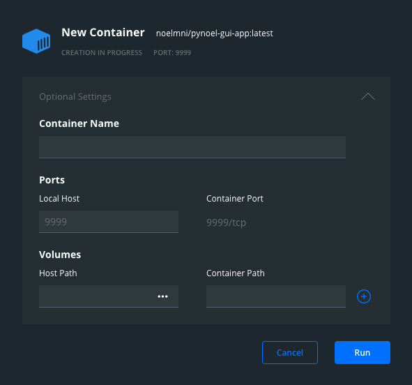
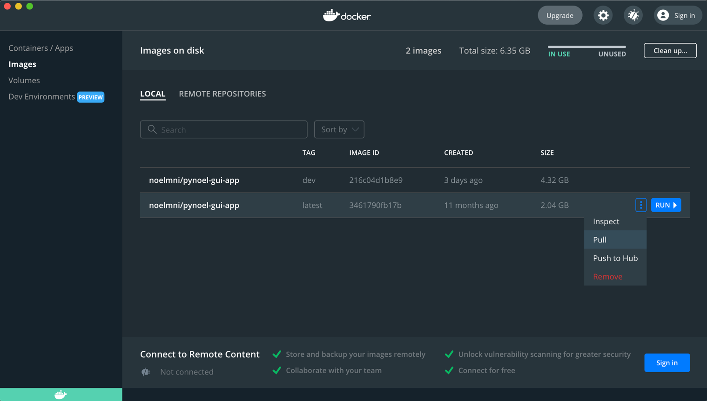
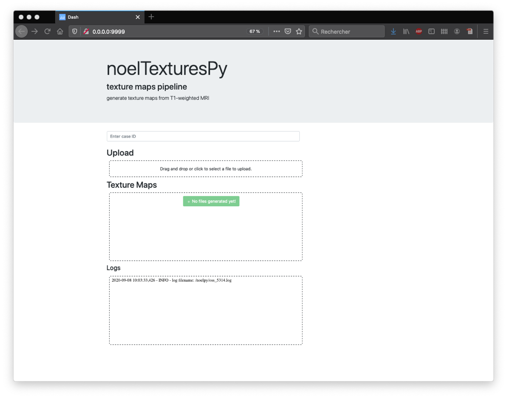
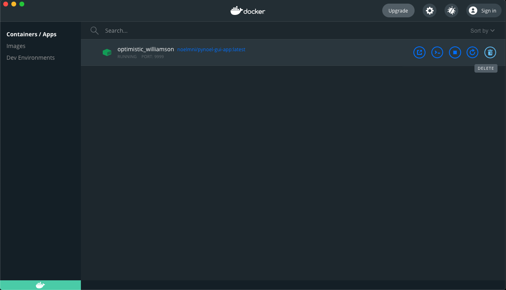
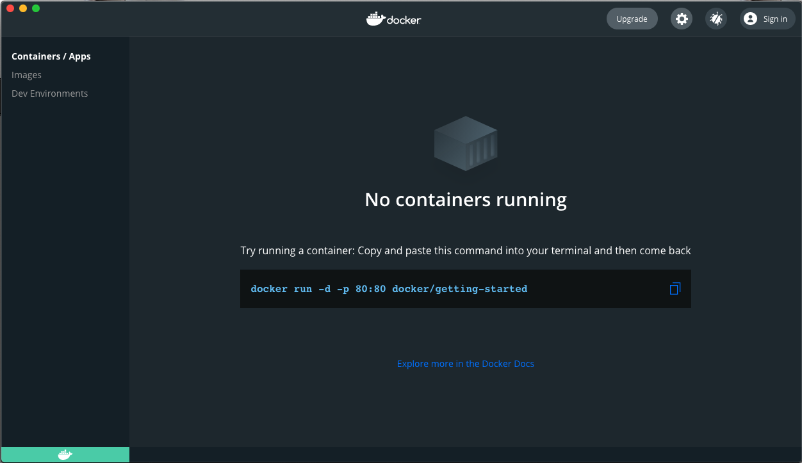
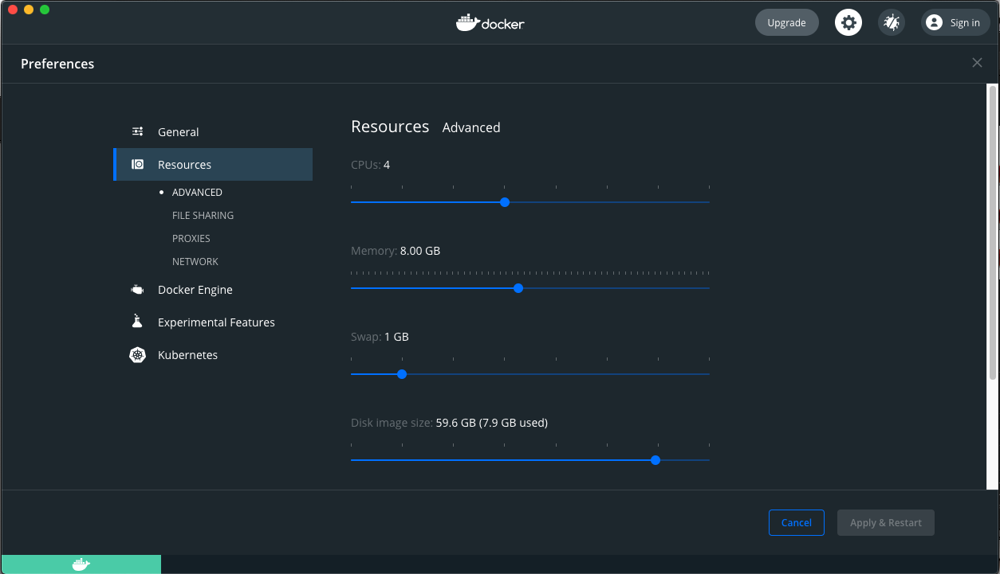

To install NoelTexturesPy, type: `docker pull noelmni/pynoel-gui-app:latest` to download the latest image. Download needs to be performed only once.

You can now run noelPyTextures from the terminal or from Docker Desktop.

### Start noelPyTextures from the terminal

To run the application, type: `docker run --rm -p 9999:9999 noelmni/pynoel-gui-app:latest`

The command executes a container running the noelPyTextures program in
background.

### Start NoelTexturesPy from Docker Desktop

To run noelPyTextures from Docker Desktop, go to "Images" tab and click
"RUN" on the line corresponding to the application (the "RUN" button
will appear when the mouse cursor hovers over the line).

On the new window, access the drop-down "Optional Settings".

Once additional options are revealed, in the "Ports" section, fill the
'Local Host' field with 9999, and hit "Run".

### Update of noelPyTextures

From time to time, we might inform you about upgrades to the processing
pipeline (which is a different process than the regular updates of
Docker Desktop itself).

You will need to update noelPyTextures docker image as follows:

In the "Images" tab in Docker Desktop, click on the three dots next to
the "RUN" button (a drop-down menu will appear). Click on "Pull", and
the software will be updated in background.

### Access and use of noelPyTextures

This application can be accessed by opening this link in your
web-browser:
[http://localhost:9999](http://localhost:9999)

!!! WARNING
    To access the website, the container running the program has to be ACTIVE. You can verify the activity by checking the tab "Containers/Apps" in Docker Desktop.

For each case, provide the 3D T1-weighted alone or together with a 3D T2-weighted (or FLAIR).

MR images must be in the Nifti (.nii or .nii.gz) format.

Prior to uploading the files, ensure the naming is correct. The T1-weighted files must include "t1" or "T1" in their filename, and the T2-weighted (or FLAIR) MRI must include either "t2", "T2", "flair", or "FLAIR". Please ensure all files are renamed before uploading.

**Example:** `john_smith_T1.nii` and `john_smith_FLAIR.nii`

Click the "Upload" section to open a file manager. This allows you to select which images you want to upload to NoelTexturesPy. You can also directly drag and drop your images from the operating system's file manager (Finder on MacOS) into the "Upload" section.

!!! WARNING
    If you want to upload two images, make sure you select both of them at once. You can NOT upload a T1-weighted image first and then the FLAIR image

To stop the processing pipeline, press Ctrl+C in the terminal at any time, or click on the 'Delete' button corresponding to the container on the tab "Containers/App" in Docker Desktop. 'Delete' option only deletes the container running the program, not the images to be processed.

**Windows Users**

If an error appears during download, "Switch to Linux containers".
Access this option by right-clicking on the docker icon in the lower
right corner of your screen.

### Processing high resolution images, beyond 1mm

If you are using images with a high resolution (e.g., 0.5 mm^3^
isotropic), the container might stop processing. This is normal, as
Docker limits resources used by the container. Limits can be overridden
in Docker Desktop, click on the "Settings" button (yellow arrow below).

Then, click on the "Resources" tab.

You can adjust the amount of Memory and Swap available for the
containers. 2GB of memory should be enough for millimetric images. For
higher resolution, you might want to increase this value to 6GB-8GB.

### How to convert DICOM to NII format

Usually, MRI data are provided in DICOM format.

As NoelTexturesPy accepts only NifTi (.nii or .nii.gz) format, you need
to convert the images.

Here are two third-party tools that can be easily installed on all major
operating systems:

-   If you feel comfortable with command line interface, you can
    download and install `dcm2niix`:
    <https://github.com/rordenlab/dcm2niix/releases>. This software is
    actively maintained.

-   If you are more comfortable with a graphical interface, you can
    download and install **MRIcroGL**:
    <https://www.nitrc.org/frs/?group_id=889>. It includes a conversion
    tool, based on `dcm2niix`.