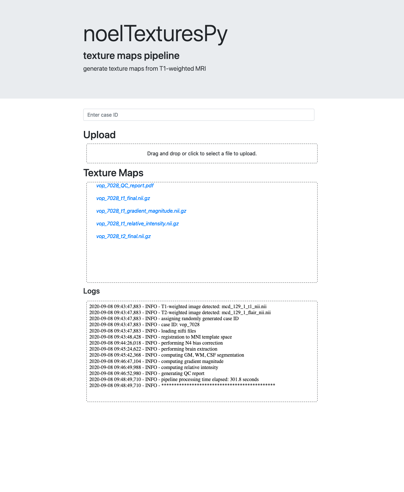
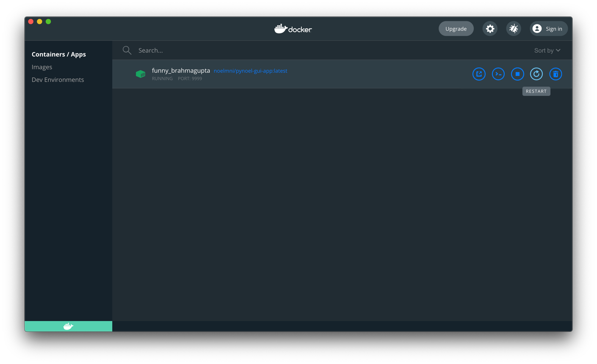
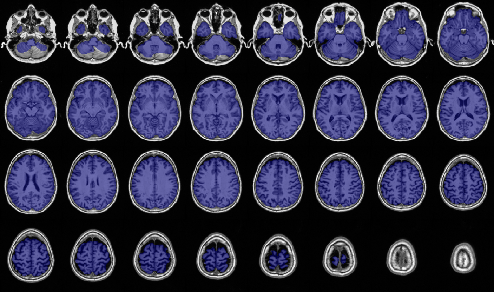
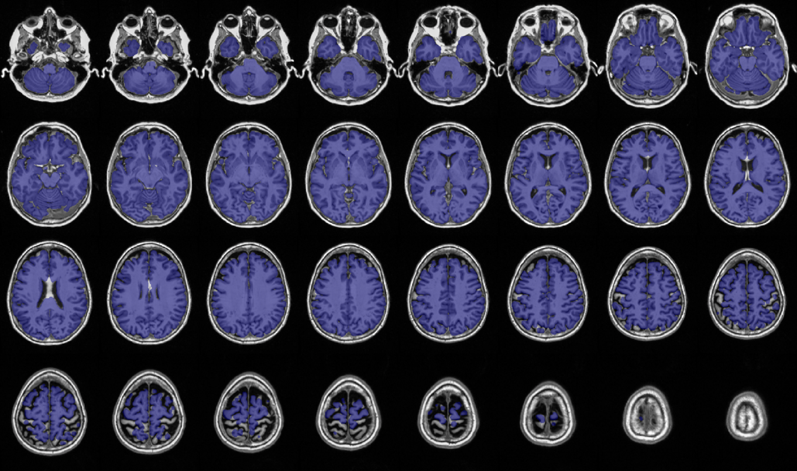
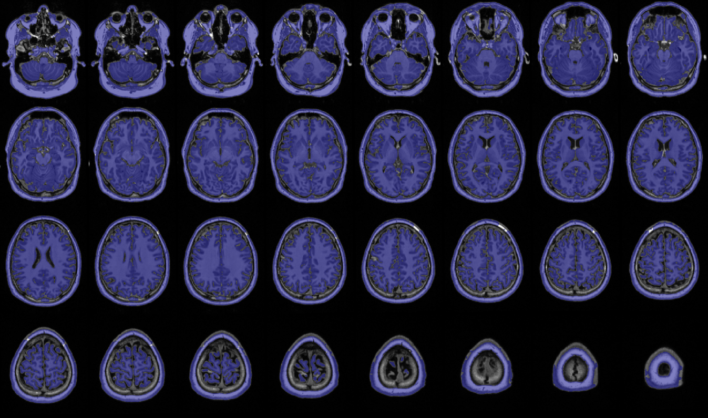
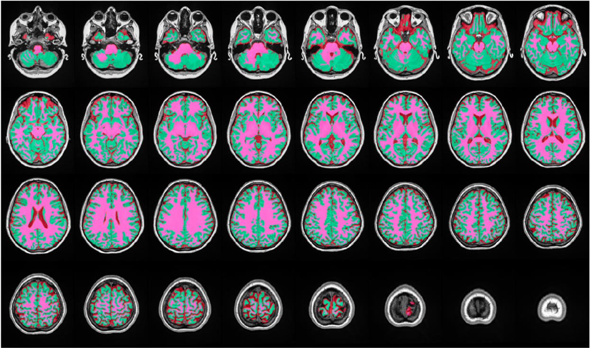
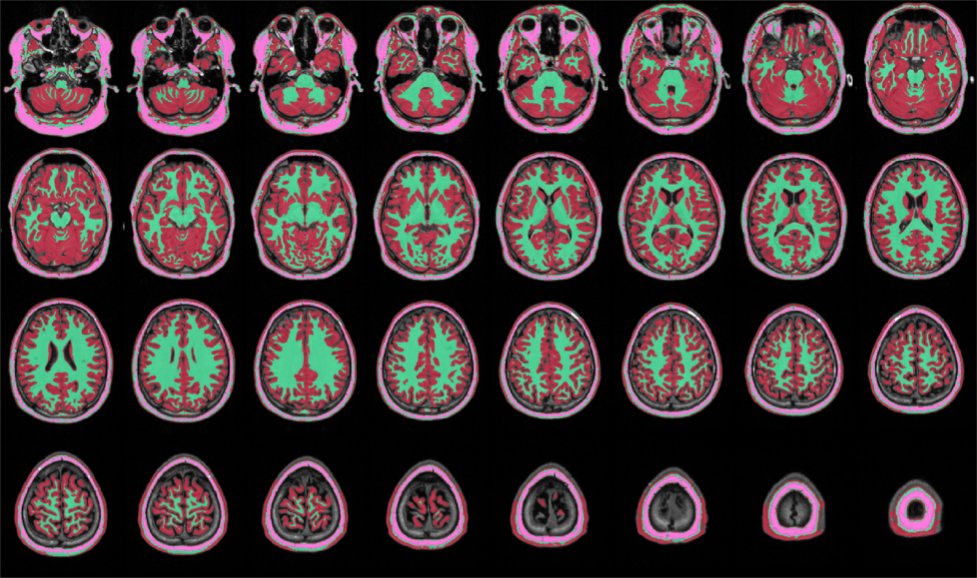

### Processing procedure

The processing steps include:
- Registration of the images to MNI152 template
- N4 intensity non-uniformity correction
- Brain extraction
- Tissue segmentation (CSF, white matter, gray matter)
- Computation of the *gradient magnitude* map (modeling FCD blurring)
- Computation of the *relative intensity* map (modeling FCD hyperintensities)
- Generation of a PDF report, which allows you to quickly inspects the output of each processing step (see details pages 15-19)

The processing files are generated in the background. The "Logs" section (see below) lists the processing steps.

Once the procedure is finished, links to the results become available in the "Texture Maps" section (see below). You will be able to download results from your browser and visualize them on your computer using a dedicated MRI visualization tool of your choice (*e.g.*, register, ITK-SNAP, fslview, freeview).

!!! info "Outputs"
    In total, 5 files are generated (with a prefix you decide, for example the name or numeric ID):

    - Prefix_t1_final.nii.gz: T1-weighted MRI registered to the MNI152 template
    - Prefix_flair_final.nii.gz: FLAIR MRI registered to the MNI152 template
    - Prefix_t1_gradient_magnitude.nii.gz: gradient magnitude derived from the t1w image
    - Prefix_t1_relative_intensity.nii.gz: relative intensity derived from the t1w image
    - Prefix_QC_report.pdf: PDF report to check the accuracy of the different processing steps
    
    Typically, the pipeline takes about 3-10 minutes (depending on the CPU core count) to run, and files will appear once all the relevant outputs have been generated.



!!! WARNING
    When the processing is finished your case, don't forget to download results. If you hit Ctrl-C in the terminal, or the "Restart" or "Delete" buttons, the running container will be deleted, along with all its content including the processed MRI outputs and the PDF report.

To process another case, shut the container down (Ctrl-C in the
terminal) and restart noelTexturesPy using the command:
```
docker run --rm -p 9999:9999 noelmni/pynoel-gui-app:latest
```

Alternatively, hit the restart button corresponding to the container in
the Docker Desktop window, as displayed in the following illustration.



In any case, do not forget to refresh NoelTexturesPy webpage.


### How to verify the quality of the processing

The file <Case-ID-**Prefix\>\_QC_report.pdf** includes 2 pages that
allow assessing whether the skull stripping and tissue segmentation
(separation of the brain into CSF, GM, and WM) are accurate.

The purpose of skull stripping is to mask out
non-brain tissue (skull, dura, optic nerve, eye balls, muscles; Figure
A, page 16) in order to identify only brain tissue. However, errors may
occur (Figure B and C).

Aside from inaccuracies in skull stripping, another reason for poor
brain tissue segmentation (such as WM labeled as GM, and vice-versa) may
be due to local intensity variations that have not been sufficiently
reduced by the correction of field inhomogeneity. Generally, in this
scenario, errors are negligeable and do not modify results.


#### Successful skull stripping

The purple mask only includes GM, WM and CSF.



#### Inaccurate skull stripping - Example 1

The purple mask misses part of the brain due to over-estimation of the
skull stripping



#### Inaccurate skull stripping - Example 2

Non-brain tissue is not sufficiently excluded (only portions of the dura
are included in the stripping process).



The skull stripping influences the quality of tissue segmentation into
CSF, WM and GM.

#### Accurate segmentation: WM (pink), GM (green) and CSF (red)



#### Erroneous segmentation
The skull stripping did not exclude the
skull, which was segmented as WM. The GM is erroneously classfied as
CSF. This type of tissue mis-calssification may lead to inaccurate
results in the texture maps!


