### Installation minc-tools-v2 to download `register` (for macOS only)

Download register (as part of a package of neuroimaging tools) here:
<http://packages.bic.mni.mcgill.ca/minc-toolkit/MacOSX/minc-toolkit-1.9.18-20200825-Darwin-10.9-x86_64.dmg>

Double-click on the downloaded file to run the installer.

Refer the following screenshots to confirm the program installed
successfully. The software versions may differ slightly between the text
and screenshots without affecting any of the subsequent steps.

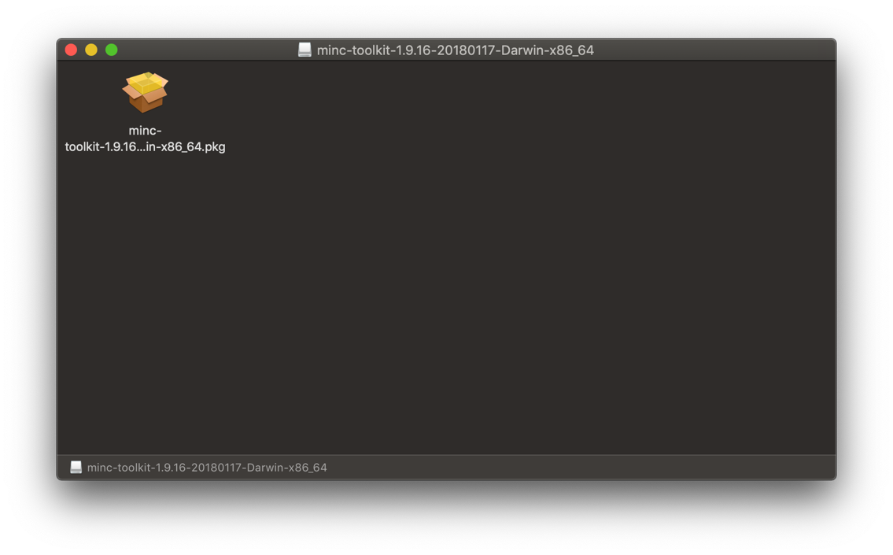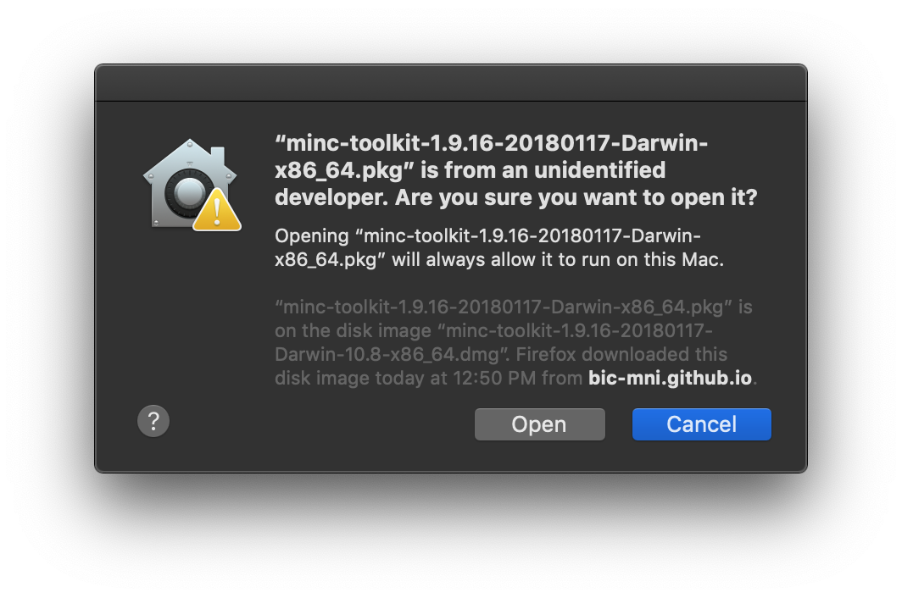

Click "Open"

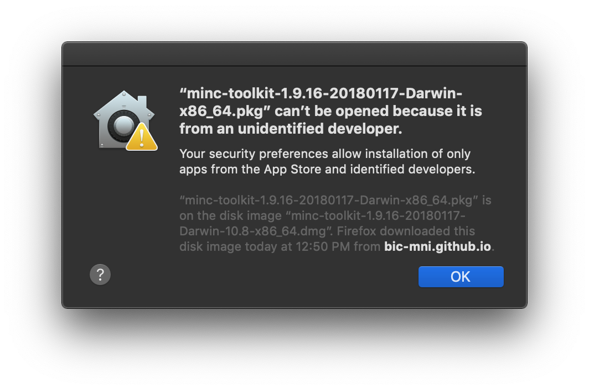

If you see the above prompt, open System Preferences \> Security & Privacy \> General, and click "Open Anyway", as shown below.

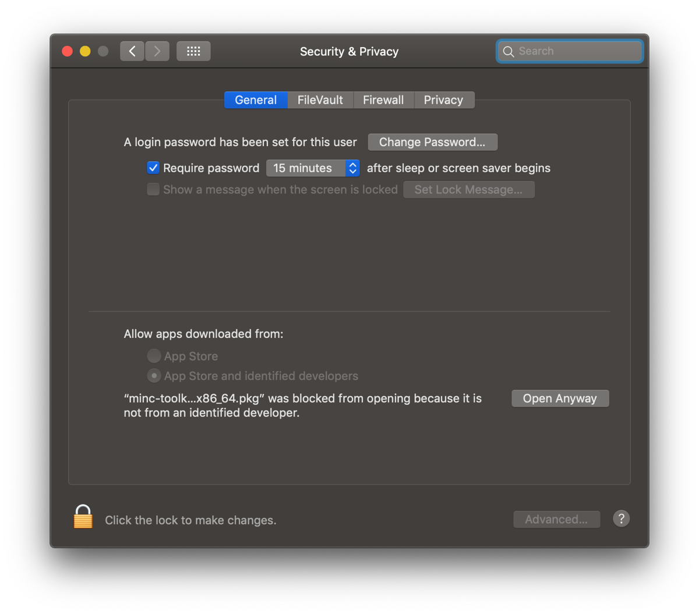

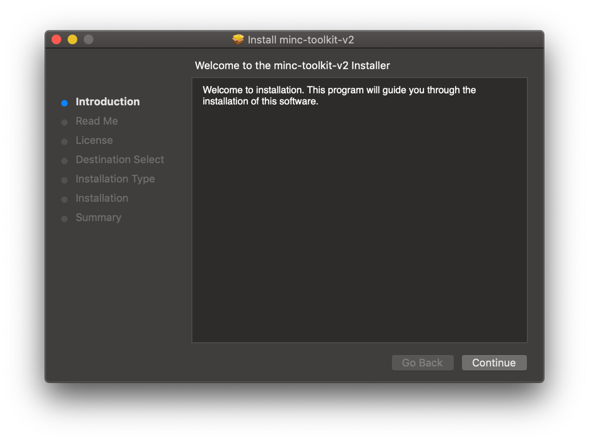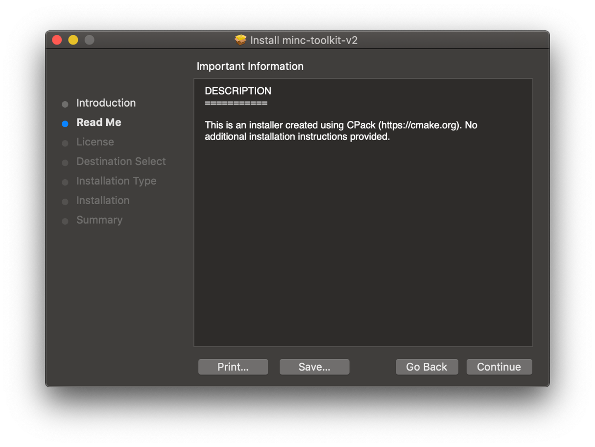

Press "Continue"

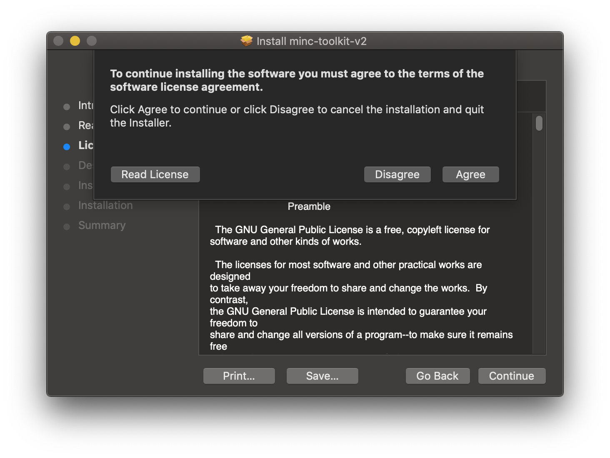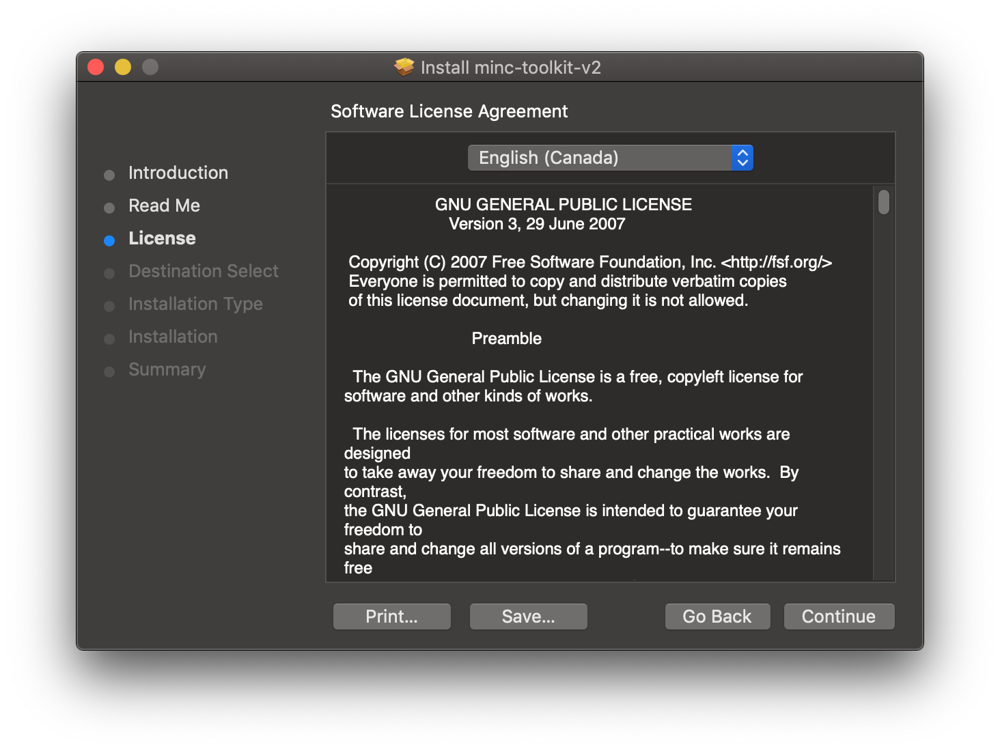

Press "Continue"

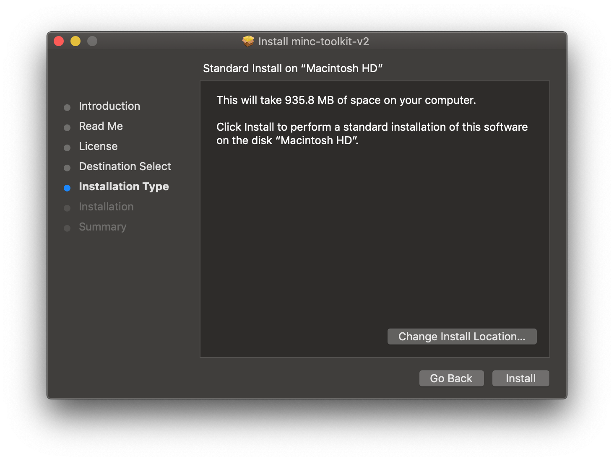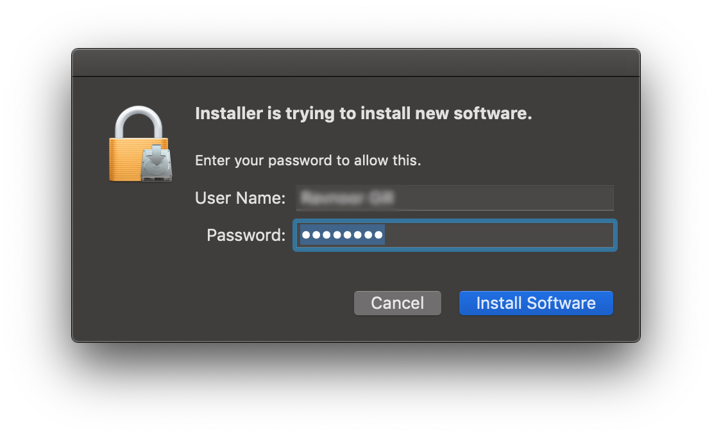

Click "Install", enter your MacOS username and password, and then press 'Install Software' 

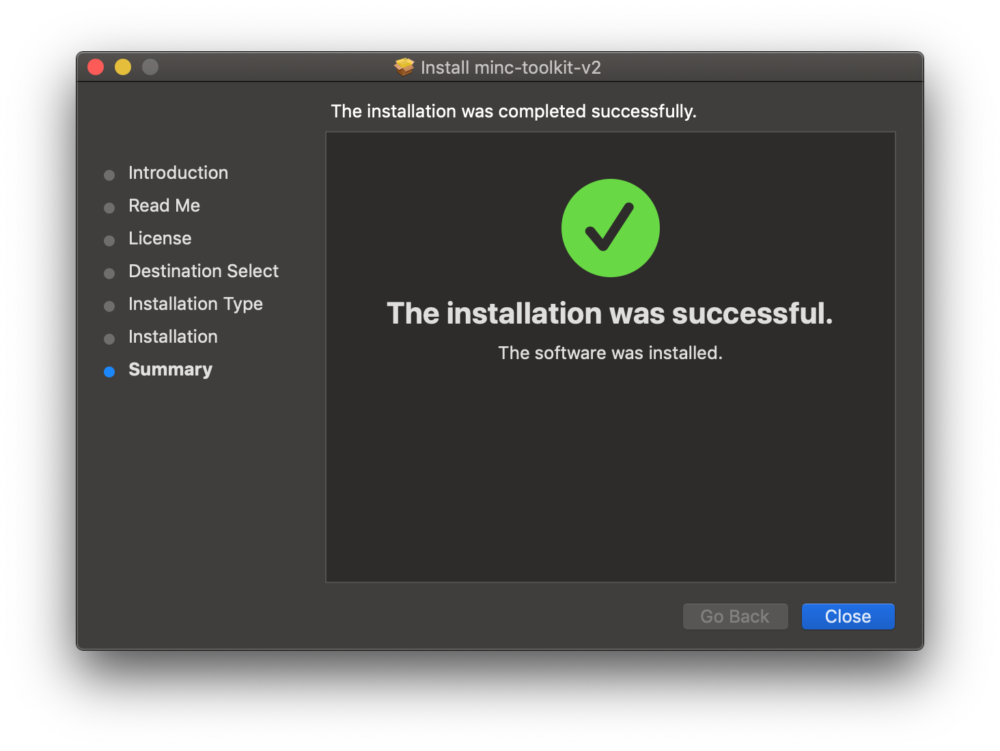

You have now successful installed the BIC-MNI minc-tools-v2

Open the 'Terminal' application.

Type:
```
echo 'source /opt/minc/1.9.18/minc-toolkit-config.sh' >> ~/.bash_profile
```

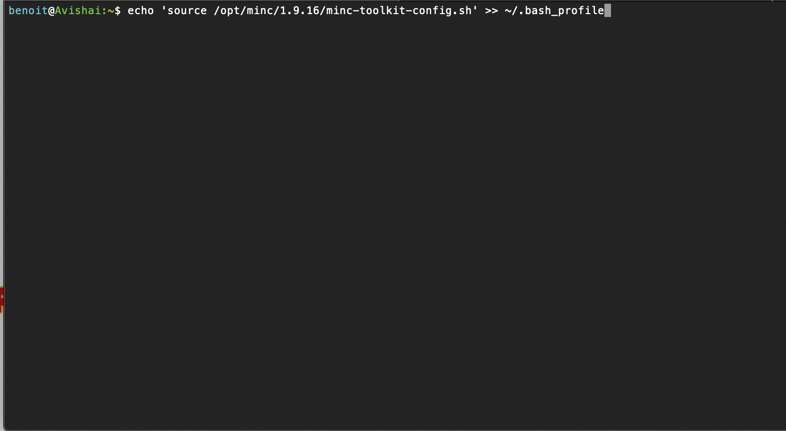


### Visualize MRIs using `register`
You can access register simply by typing register in the Terminal app.

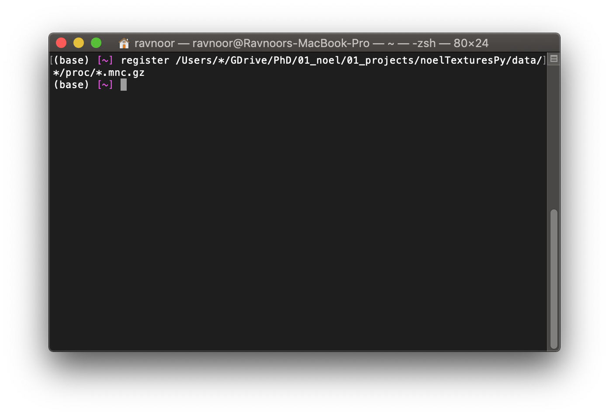

Navigate to the folder where your images are stored before launching register if you don't want to type the whole path.

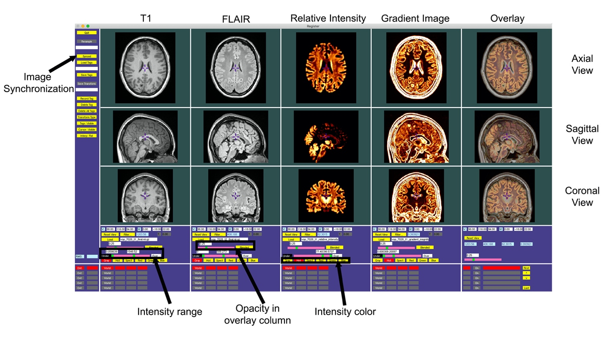

Images are simultaneously viewed in the three orthogonal axes (axial, sagittal, coronal).

From left to right: T1, FLAIR, Relative intensity and intensity (modeling blurring). The last set of images on the right present all images overlayed (you can scroll through them using the green cursor).

Intensity range and intensity colors can be individually adjusted.

Since images are co-registered and in the same anatomical space, you can scroll through them simultaneously by clicking on the "Synced/Not Synced" button in the upper left area. By doing so, the cursor will be in the same voxel across all images and views.

!!! WARNING
    When you set your folder and file names, avoid the use of whitespaces. For example, use 'Texture-Analysis' or 'Texture_Analysis' instead of 'Texture Analysis'. It is much easier to navigate the file system in the terminal when there are no spaces in the naming structure. The reason is that you have to introduce backslashes ('\\') or quotes in the command to take these spaces into account.

    ```
    register '/Users/benoit/Texture Pipeline/'* &
    register /Users/benoit/Texture\ Pipeline/* &
    ```
    instead of
    ```
    register /Users/benoit/Texture_Pipeline/* &
    ```
    Note the positioning of the quotes in the first version.